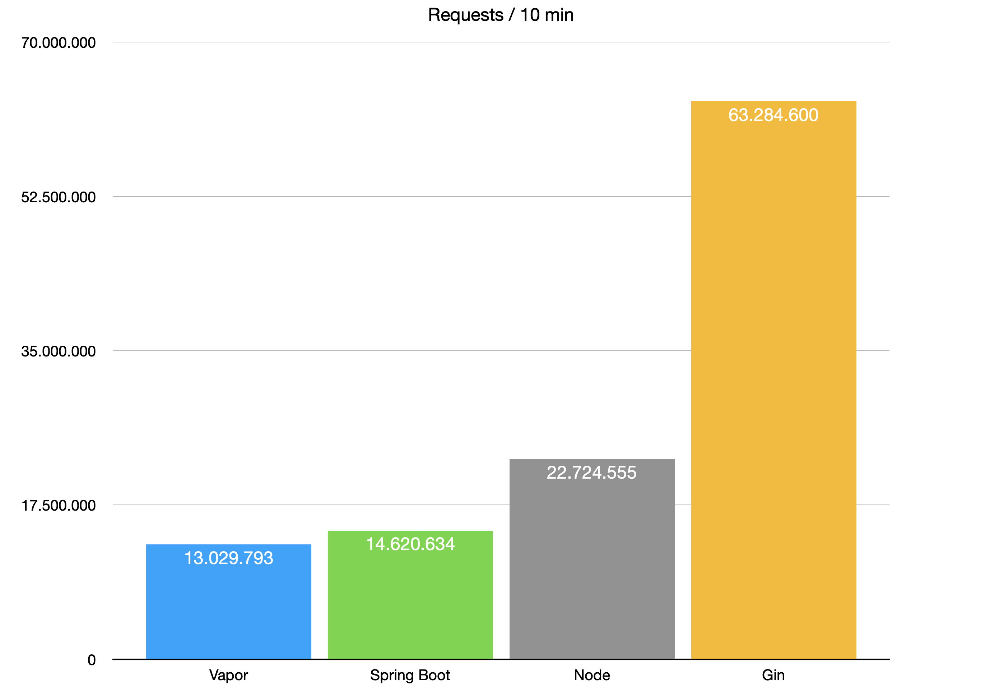
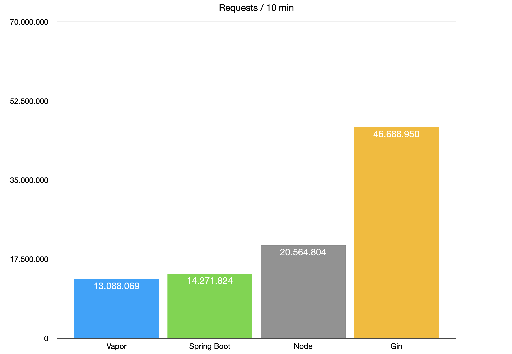
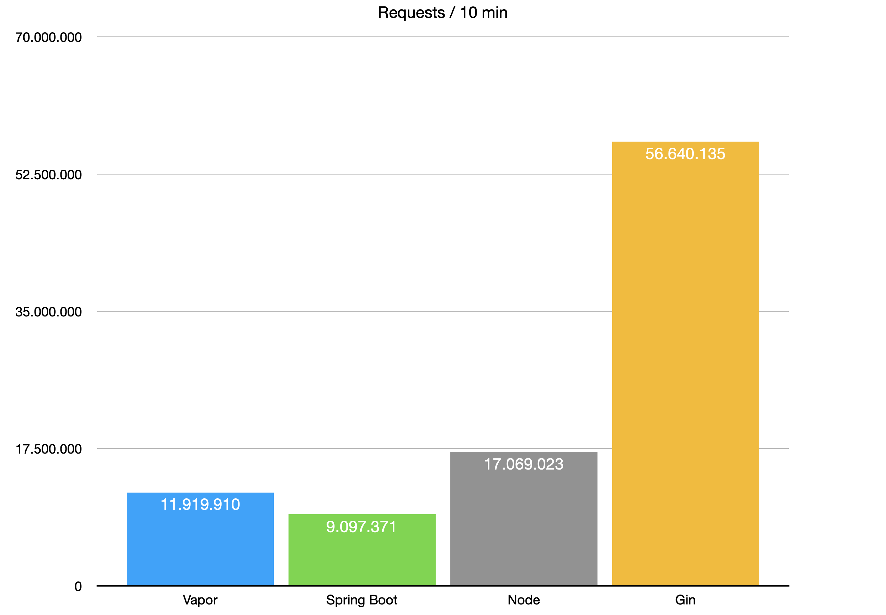

# Server Frameworks back-to-back comparison

## Intro

Today there are too many ways to provide a server with an App. As usual, a programmer will chose one, with which he / she has most experience.

But is it worth it to switch to a new server framework or even a programming language if a new framework is more attractive? Lets find out.

In this article the following server frameworks will be compared:

- [**Java** - Spring Boot](https://spring.io/projects/spring-boot)
- [**JavaScript** - Node.js](https://nodejs.org/en/)
- [**Swift** - Vapor](https://vapor.codes)
- [**Go** - Gin](https://gin-gonic.com)

We will measure:
- performance (requests / time)
- memory footprint
- cpu usage

## Setup

To reproduce the results here is the setup used for measuring performance:
- Host:
  - iMac 24", Apple M1, 16Gb RAM
  - Oracle JDK 16.0.2
  - Node 16.3.0
  - Swift 5.4.2
  - Go 1.17
- Tester:
  - MacBook Pro 15", 2.2 GHz 6-Core Intel Core i7, 32Gb RAM
  - [wrk](https://github.com/wg/wrk)

The connection was established via Thunderbolt Bridge.

To achieve best performance, there should be no open Apps except the process under test.

### Spring Boot

Spring boot was launched with `mvn spring-boot:run`. 

Only one process is needed, as Java can manage multiple cores of CPU.

### Node.js

Node was launched with `npm run start`.

Node can only operate on 1 CPU for a given process. We launch 8 threads from `index.js` thus taking advantage of all available cores. Change this number to match your host.

### Vapor

Vapor can manage all cores from one process. Vapor was launched with `vapor run serve -e prod`.

### Gin

Gin can manage all cores from one process. Gin was launched with `go run main.go`.

### Tester

To test the frameworks, `wrk -d 10m -t 4 -c 50 http://127.0.0.1:8080` is used with the following parameters:
- `-d 10m` - run for 10 minutes
- `-t 4` - use 4 threads
- `-c 50` - use 50 connections

These parameters were found to give the best performance measurements.

Used [test parameters](./run_all.sh) as well as [1 min](./run_all_result.log) and [10 min](./run_all_result_1m.log) test results are provided.

## Test cases

### Simple

In a simple scenarion a response is a random number between 0 and 1000. It should suffice for a baseline of a simple response from server.

### JSON

Typically a backend server will return a JSON object. In our simple test no Database connection was made to reduce all influencing factors. A simple JSON object is returned as a response containing 20 keys with 20 values - random numbers generated between 0 and 1000.

### Static

As a standart feature of a given framework a static file is provided at path of an empty html file. No implementation of any sort is required - only a configuration of a given framework.

## Short results

### Simple response

### Json response

### Static response

